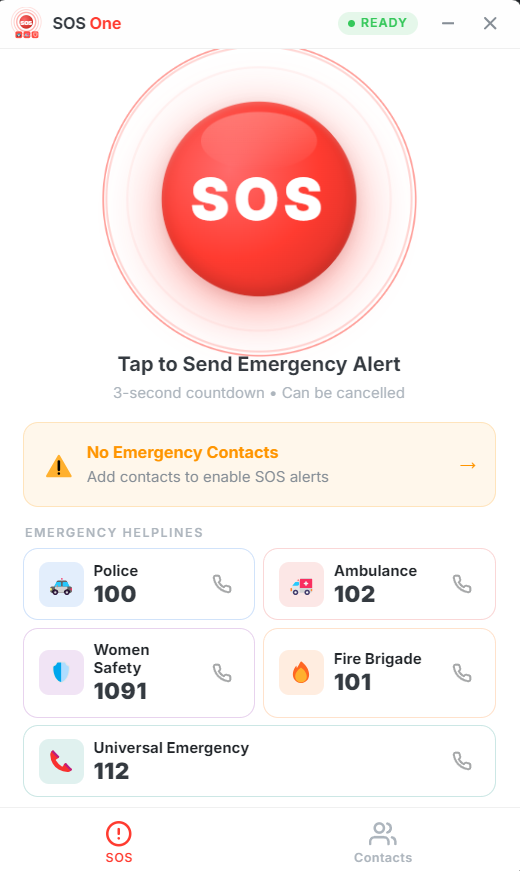
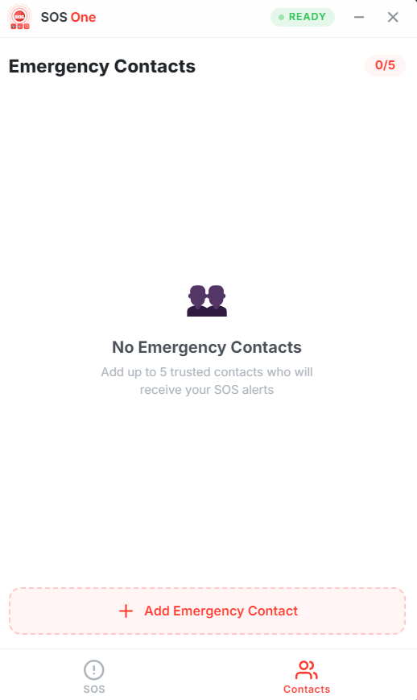

<p align="center">
  
</p>

<h1 align="center">SOS One - Emergency SOS Desktop Software</h1>

<p align="center">
  <b>One tap. Three seconds. Emergency alert ready.</b><br>
  A fast, single-window Electron desktop software focused on emergency response UX.
</p>

<p align="center">
  
  
  
  
  
</p>

---

## Overview

SOS One is a desktop emergency assistant software built with Electron.js.

It is designed for speed and clarity:
- one large SOS action
- a 3-second cancellable countdown
- location capture with Google Maps link
- emergency contact notifications (simulated)
- quick-dial access to helpline numbers

This repository is intentionally maintained as a **desktop-only software project**.


---

## Project Goal

The main goal is to demonstrate a clean emergency flow that can be triggered in seconds, with minimal cognitive load during stress situations.

The software is built as a practical portfolio/project-base example for:
- Electron desktop architecture (main + preload + renderer)
- secure IPC communication
- local data persistence
- focused, utility-style UI/UX

---

## Why This Software Has Value

- Fast response UX: emergency action is centered and obvious.
- Low friction: no complex onboarding to test the flow.
- Desktop utility feel: frameless compact window, quick launch, single-instance behavior.
- Demonstration quality: good for interview/project showcase on Electron fundamentals.

---

## Core Features

### SOS Flow
- One-tap SOS trigger button
- 3-second countdown with cancel option
- GPS geolocation lookup (with fallback behavior)
- Emergency message template generation
- Native desktop notification after alert send

### Contact Management
- Add, edit, delete emergency contacts
- Maximum 5 contacts
- Duplicate phone detection
- Local storage persistence

### Helpline Access
- Police: 100
- Ambulance: 102
- Women Safety: 1091
- Fire Brigade: 101
- Universal Emergency: 112

### Desktop App Experience
- Frameless custom title bar
- Minimize and close controls
- Single-instance lock
- Lightweight single-page renderer UI

---

## Trial / Prototype Disclaimer (Important)

This software is a **trial/prototype**.

Use case:
- education and learning
- portfolio and demonstration
- UX proof-of-concept

Limitations:
- does not send real SMS to telecom networks
- does not place real emergency calls directly
- should not be used as a production emergency safety system

Treat this as a technical demonstration, not a certified emergency product.

---

## Tech Stack

- Electron 33+
- HTML5, CSS3, Vanilla JavaScript
- localStorage for local persistence
- Browser Geolocation API

---

## Project Structure

```text
SOS-One/
|- main.js
|- preload.js
|- package.json
|- renderer/
|  |- index.html
|  |- css/
|  |  |- style.css
|  |- js/
|  |  |- app.js
|  |- assets/
|     |- icon.png
|- README.md
```

---

## Setup and Run

### Prerequisites
- Node.js 18+
- npm

### Installation

```bash
git clone https://github.com/YOUR_USERNAME/SOS-One.git
cd SOS-One
npm install
```

### Run Application

```bash
npm start
```

### Development Mode

```bash
npm run dev
```

---

## How the SOS Sequence Works

1. User taps SOS.
2. Countdown starts (3 seconds).
3. User can cancel during countdown.
4. App captures location (if available).
5. App builds emergency message.
6. App simulates contact notification.
7. App shows confirmation + location link.

---

## Configuration Notes

- SOS message template can be adjusted in renderer logic.
- Window size and Electron behavior can be tuned in main process config.

---

## License

MIT License

---

## Author

Sachin

---

Built with Electron.js for rapid emergency UX prototyping.
